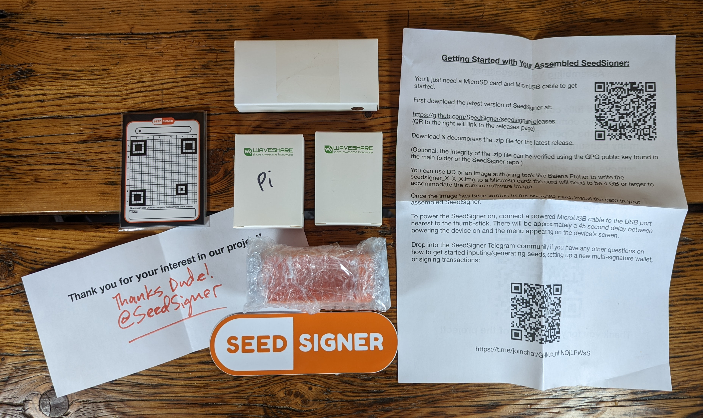
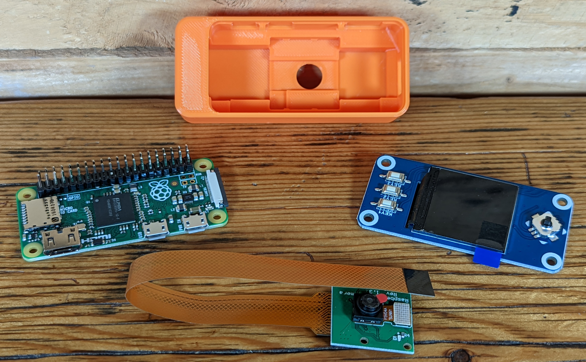
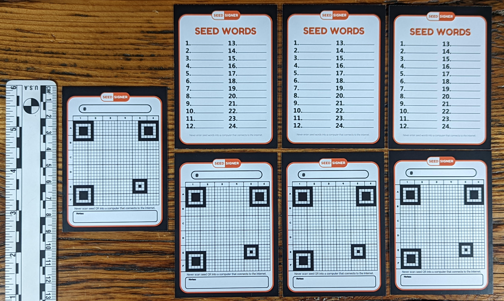

# Unboxing
This section demonstrates what is included in the full SeedSigner kit. The kit can be purchased from [BTC Hardware Solutions](https://btc-hardware-solutions.square.site/) with worldwide shipping available. Alternatively, EU/UK customers can purchase the kit from [GoBrrr](https://www.gobrrr.me/?v=7516fd43adaa) or [DIYNodes](https://diynodes.com/), and Philippines customers can use [TechHaven](https://www.lazada.com.ph/products/preassembled-seedsigner-in-open-pill-case-i2659439195-s12652647245.html?spm=a2o4l.seller.list.18.111a346bP5V0no&mp=1&freeshipping=1).

The SeedSigner kit includes the following components:

- RaspberryPi Zero
- RaspberryPi Camera
- Ribbon cable for the camera
- WaveShare LCD Hat 
- 3D printed open-face case
- Seven blank QR code/menmonic phrase cards
- SeedSigner sticker
- "Getting Started" instructions
- "Thank You" card

The SeedSigner kit comes with most everything you will need to get started, the only pieces you will need to supply yourself are a MicroSD card at least 4GB in capacity and a microUSB cable. Assembly required.

The included blank QR code/mnemonic phrase cards measure 64mm x 89mm These cards feature 24 blank spaces for seed words on one side, along with a warning that reads: "_Never enter seed words into a computer that connects to the internet_". On the opposite side, there is a blank 29 x 29 QR code grid with room for the wallet fingerprint and some notes, along with a warning that reads "_Never scan seed QR into a computer that connects to the internet_".

Alternatively, one can opt to use the stainless steel version of the QR code backup. 

(Insert steel plate photo(s)/explainer)
