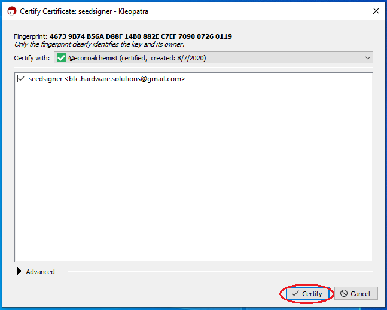

# Software
This section demonstrates how to download the SeedSigner image and flash it to your MicroSD card. You will need to supply your own MicroSD card that has at least a 4GB capacity. Best practice is to test your hardware with the software image to make sure everything works prior to attempting assembly with the 3D printed enclosure. 

## Step 1: Download
Navigate to the [SeedSigner GitHub Repo](https://github.com/SeedSigner/seedsigner/releases) and look for the latest release.

Scroll to the bottom of that release section and click on the link to download the `.zip` file. If you would like to verify your download, click on the links to download the `.sha256` file and `.sig` file as well. Save these files in the same folder location. 

## Step 2A: Verify - Windows
This step is optional but recommended. This will ensure that you have downloaded the file that the SeedSigner developers intended on you receiving. This step will demonstrate how to verify on a Windows platform. Skip to `Step 2B` if you are using a Linux platform. Or skip to `Step 3` if you do not wish to verify your software download that will be handling your Bitcoin private keys.

The following instructions make an assumption that you already use Kleopatra from the [gpg4win software bundle](https://www.gpg4win.org/features.html) and have your own PGP key setup.

- First you will need the SeedSigner public key which you can find [here](https://github.com/SeedSigner/seedsigner/blob/main/seedsigner_pubkey.gpg). 
- Copy the public key to your clipboard.
- Open Kleopatra, navigate to `Tools` > `Clipboard` > `Certificate Import`. 

- You should receive a dialog that informs you the certificate was imported sucessfully. Click on `OK`.
- Now you can compare the fingerprint in Kleopatra to a known publicly displayed fingerprint such as [SeedSigner's Twitter profile](https://twitter.com/SeedSigner).

- Now you can right-click on the SeedSigner certificate in Kleopatra and select `Certify`. 
- You will be prompted to enter your password.

 

- Open the folder containing the `.zip` file, `.sha256` file, & `.sig` file. 
- Right-click on the `.sig` file.
- Select `More GpgEX options` > `Verify`.

 

- Kleopatra will now use the signature file and the SeedSigner public key to verify the `.sha256` file. 
- You should receive a dialog displaying the sucessful verification. 

It is important to be able to distinguish between a valid and certified signature, a valid signature, and an invalid signature. Because the SeedSigner public key was certified by comparing the resulting fingerprint to a known publicly displayed fingerprint, the Kleopatra software prints a valid and certified dialong in green. 

 

If you did not take the extra step to certify the SeedSigner public key, then Kleopatra can still determine that the signature is valid, but not certified. Meaning that the public key and accompanying signature are valid but that they could be from some other entity impersonating the developer. These dialogs will be printed in white. This is still a valid matching signature, it's just that unless you take that extra step to certify the fingerprint of the public key then do you really know it is a valid signature from SeedSigner and not an impersonator? 

 

  

Or if there has been some manipulation in the file you downloaded and it is not authenticaly signed by the SeedSigner key, Kleopatra will print the dialog in red. This is an invalid signature and you should not proceed with decompressing the `.zip` file. 

 

Now that you have verified the authenticity of the accompanying `.sha256` file, you can rest assured that sha256 hash value contained within it is in fact the hash value that you should be able to independantly generate on the accompanying `.zip` file. To generate hash values on files, you can use a convenient freeware hex editor tool called [HxD](https://mh-nexus.de/en/hxd/). 

- In HxD, navigate to `File` > `Open` and select the SeedSigner `.zip` file
- Navigate to `Analysis` > `Checksums` > `SHA256`

- Now you can open the SeedSigner `.sha256` file with a text editor like Notepad.
- Compare the hash values between HxD and the SeedSigner file.

After verifying the hash value, you know that the `.zip` file is authenttic. If the hash values do not match, then do not decompress the `.zip` file. It is a good idea to close the `.zip` file from HxD at this point. You can skip ahead to `Step 3` now. 

## Step 2B: Verify - Linux

## Step 3: Flash
