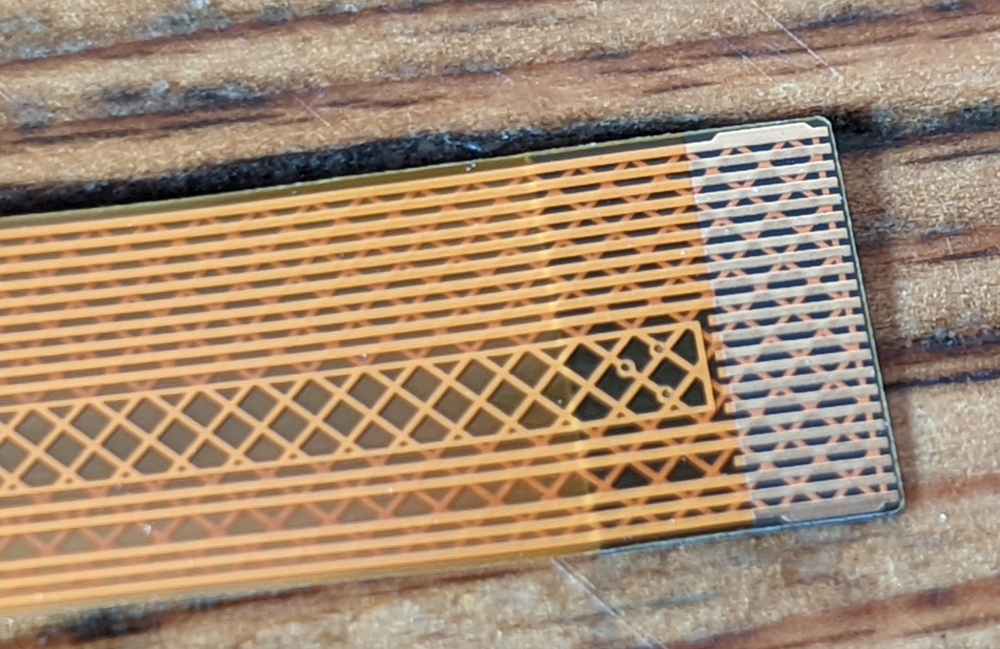
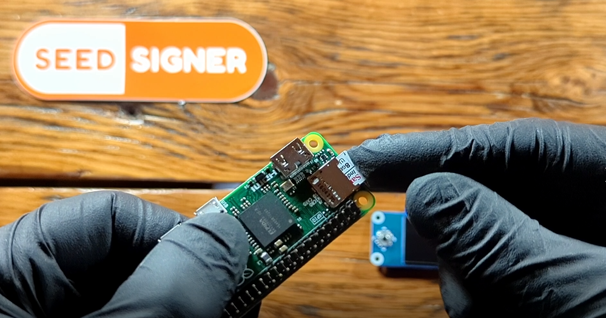
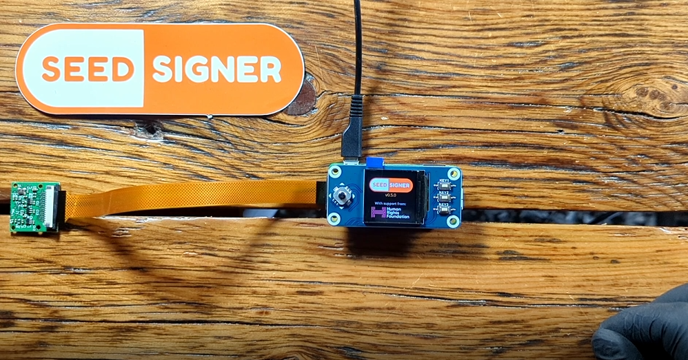

# Hardware
This section demonstrates how to test and assemble the SeedSigner kit and also provides details on what each component is and alternative places to purchase these components in case you do not want to purchase the whole kit from one vendor. Best practice is to test that your components power on and the SeedSigner software works prior to assembly. The enclosure and or components can be damaged if you attempt disassembly. 

## The Enclosure
The enclosure included in the kit is an open-face design, alternative designs are available from vendors linked below. The enclosure is 3D printed, you can even [download the file](https://github.com/SeedSigner/seedsigner/tree/main/enclosures/open_pill) and print one yourself. Be sure to check out some [community designs](https://github.com/SeedSigner/seedsigner#community-designs) as well. The enclosure featured here is designed to be the most basic enclosure and the quickest to reproduce. Various enclosure design files can be downloaded from [here](https://github.com/SeedSigner/seedsigner/tree/main/enclosures) or there are a number of distributors that offer alternate designs [here](https://www.cryptocloaks.com/product/seed-signer-pill/), [here](https://btc-hardware-solutions.square.site/s/shop), & [here](https://robotechy.com/collections/frontpage). 

The enclosure outer dimensions are 80mm x 35mm x 26mm and there are a number of retention bumps, support ledges, and journals to fit the components snugly inside.  

The enclosure also features openings for the camera lens, microUSB ports, HDMI port, and MicroSD card port.

If you do not want to get the complete kit, you can buy a stand alone enclosure of various designs from the following vendors:

- Worldwide delivery available from [BTC Hardware Solutions](https://btc-hardware-solutions.square.site/product/orange_pill/5?cs=true&cst=custom)
- Worldwide delivery available from [Robotechy](https://robotechy.com/collections/frontpage/products/seedsigner-3d-printed-pill-case)
- EU/UK delivery available from [GoBrrr](https://www.gobrrr.me/product/seedsigner-lilpill-case/?v=7516fd43adaa), [DIYNodes](https://diynodes.com/product/seedsigner-3d-printed-orange-pill-case/), & [AnchorHodl](https://anchorhodl.com/product/retro-pill-case-for-seedsigner)

## The Camera & Cable
The camera is a 5MP OV5647 Sensor, 30 FPS, 2592x1944 resolution video camera module designed for a range of RaspberryPis. The working voltage is 1.7vdc ~ 3vdc. This module measures 25mm x 24mm x 9mm. The camera ships with a protective film over the lens, be sure to remove this prior to assembly.

You want the `HBV-Raspberry-160FPC` golden ribbon cable for the RaspberryPi Zero. This cable has 16-flat-pin connector side measuring 16mm, a 22-flat-pin connector side measuring 11mm, and the overall length is 160mm.

If you do not want to get the complete kit, you can buy a stand alone camera & cable from the following vendors:

- EU/UK delivery available from [GoBrrr](https://www.gobrrr.me/product/ov5647-pi-cam/?v=7516fd43adaa)
- North America delivery available from [Amazon](https://www.amazon.com/dp/B07RXKZ1KN?th=1)
- Philippines delivery available from [TechHaven](https://www.lazada.com.ph/products/raspberry-pi-camera-i2659578273-s12654014174.html?spm=a2o4l.seller.list.4.111a346bP5V0no&mp=1&freeshipping=1)

## The RaspberryPi Zero v1.3
The RaspberryPi Zero is the smallest single board computer RaspberryPi manufactures. The v1.3 computer features a 1Ghz single-core CPU, 512MB of RAM, mini-HDMI port, one microUSB port for power only, one microUSB port for data transfer, a HAT-compatible 40-pin header, composite video & reset headers, a microSD card slot, and a CSI camera connector. The full hardware specification can be found [here](https://www.raspberrypi.com/documentation/computers/raspberry-pi.html). 

The RaspberryPi Zero measures 66mm x 31mm x 11mm. 

If you do not want to get the complete kit, you can buy a stand alone RaspberryPi Zero from the following vendors:

- EU/UK delivery available from [GoBrrr](https://www.gobrrr.me/product/pizero-wh/?v=7516fd43adaa)
- EU delivery available from [BricoGeek](https://tienda.bricogeek.com/placas-raspberry-pi/1358-raspberry-pi-zero-v1-3.html) or [Reichelt](https://www.reichelt.com/ch/en/raspberry-pi-zero-v-1-3-1-ghz-512-mb-ram-rasp-pi-zero-p256439.html)
- North American delivery available from [Adafruit](https://www.adafruit.com/product/2885)
- Philippines delivery available from [TechHaven](https://www.lazada.com.ph/products/raspberry-pi-zero-version-13-i2659573158-s12653906040.html?spm=a2o4l.seller.list.1.111a346bP5V0no&mp=1&freeshipping=1)

If you are having a difficult time finding the RaspberryPi Zero hardware, some alternative sources are [Rpi Locator](https://rpilocator.com/) or possibly the [Raspi Zero W](https://www.raspberrypi.com/products/raspberry-pi-zero-2-w/), make sure to do your homework on compatibility with this version prior to purchasing it. Alternatively, if you are only able to find the WiFi and or BlueTooth enabled versions of the Raspberry Pi Zero, then [this](https://github.com/DesobedienteTecnologico/rpi_disable_wifi_and_bt_by_hardware) guide by [@DesobedienteTec](https://twitter.com/DesobedienteTec) will show you how to disable the communication radios. 

## The WaveShare LCD HAT Display
The WaveShare LCD Hardware-Attached-on-Top (HAT) is a 65mm x 30mm module that attaches to the 40-pin connector on the RaspberryPi Zero. This module features a 240x240 resolution, RGB display measuring 39mm diagonal. The embedded controls use a joystick and three push-buttons. Operating voltage is 3.3vdc. More specifications can be found [here](https://www.waveshare.com/wiki/1.3inch_LCD_HAT).

If you do not want to get the complete kit, you can buy a stand alone WaveShare LCD HAT Display from the following vendors:

- EU/UK delivery available from [GoBrrr](https://www.gobrrr.me/product/waveshare-lcd-display/?v=7516fd43adaa)
- EU delivery available from [Welectron](https://www.welectron.com/Waveshare-14972-13inch-LCD-HAT_1)
- North America delivery available from [WaveShare](https://www.waveshare.com/1.3inch-lcd-hat.htm)
- Worldwide delivery available from [AliExpress](https://www.aliexpress.com/item/32952472064.html)
- Philippines delivery available from [TechHaven](https://www.lazada.com.ph/products/waveshare-14972-13inch-lcd-hat-i2659455966-s12653987690.html?spm=a2o4l.seller.list.7.111a346bP5V0no&mp=1&freeshipping=1)

# Testing
Testing the hardware with the SeedSigner software is a good idea. If you assemble everything and then find out that something doesn't work, you can damage the components and or enclosure trying to disassemble it. 

## Step 1: Release Camera Retainer
On the Raspberry Pi Zero board, gently pull the tabs out on the camera connection port. When these tabs are depressed, they will lock the ribbon cable in place.

## Step 2: Connect Ribbon Cable
Make sure the ribbon cable is facing the correct direction, the gold connectors should be facing the bottom side of the Raspberry Pi Zero circuit board. Insert the ribbon cable until it stops, then press the tabs down to lock the ribbon cable in place. 

  
     

## Step 3: MicroSD Card 
Insert the MicroSD card with the flashed SeedSigner image. Ensure the MicroSD card is facing the correct direction, again the gold contacts should be facing the bottom of the Raspberry Pi Zero circuit board. 

  
     

## Step 4: Display
Connect the LCD display, making sure that the pins on the Raspberry Pi Zero circuit board are all straight and that they won't get bent by being misaligned. This will just loosly attach to the Raspberry Pi Zero circuit board, it is not going to snap into place until you do the final assembly in the 3D printed enclosure.

## Step 5: Power on & Test
Connect your power cable and wait about 45 seconds for the SeedSigner to activate. Then test out the joy stick and buttons on the LCD display and ensure that the camera works. 

  
     

Now that you have checked that everything is working, you can power off the SeedSigner by selecting the power icon in the upper right-hand corner from the main menu. Then you can disassemble everything and re-assemble it in the 3D printed enclosure. 

# Assembly
Prior to attempting assembly, ensure that you have tested that everything works by connecting the camera and display to the RaspberryPi Zero, inserting the MicroSD card with the SeedSigner image loaded, and powering on the device by connecting a microUSB cable to the power input port. 

## Step 1: Materials Check
Gather your tested components. You should have the 3D printed enclosure, Raspberry Pi Zero, MicroSD card, LCD display, Camera module, and ribbon cable. 

## Step 2: Camera Module
Remove the protective layer of film from the camera lens. Then snap the camera module into place under the retainer clips. If the ports for the USB connections are facing away from you then the ribbon cable should be going to the right-hand side.  

## Step 3: Raspberry Pi Zero
Insert the Raspberry Pi Zero circuit board. Make sure you remove the MicroSD card first. The ribbon cable will fold over the camera module, with the slack tucking underneath the enclosure recess. 

Align the USB connectors with the ports on the enclosure, the circuit board will be at a slight angle, then you can press down on the side with the PINs until you hear it snap into place. 

  
  
  
   

## Step 4: MicroSD Card
Then you can insert the MicroSD card again. Then press the LCD display into place on the PINs of the Raspberry Pi Zero circuit board, taking care ensure the pins are aligned. This should fit tightly and not be loose. 

  
  

## Step 5: Power on & Test
Plug in your power cable and make sure everything works. Then you are ready to start setting up your new Bitcoin seed phrase.

You may be able to find additional resources in [this](https://github.com/shishi21m/SeedSigner-Guides/blob/main/SeedSigner%20Build%20Guide.pdf) guide by [@shishi21m
](https://twitter.com/shishi21m). 
