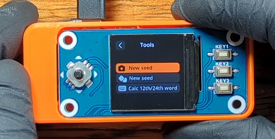
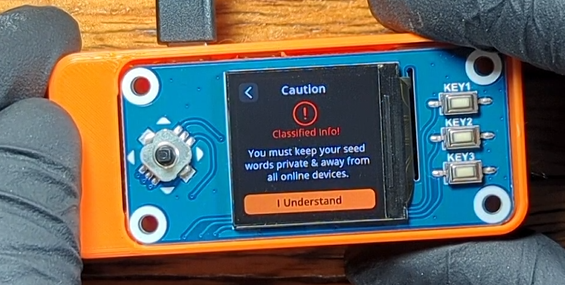
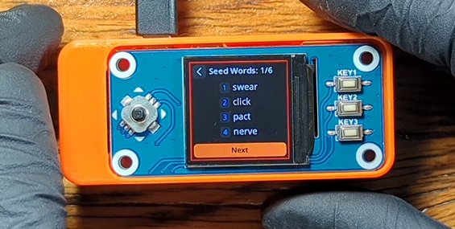
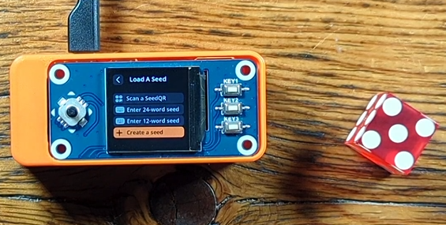
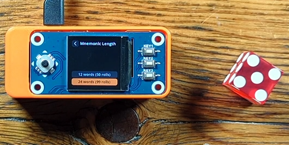
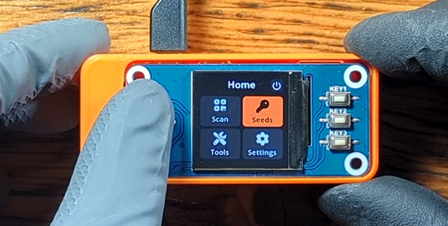
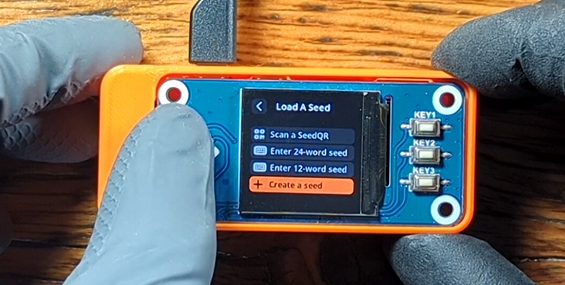
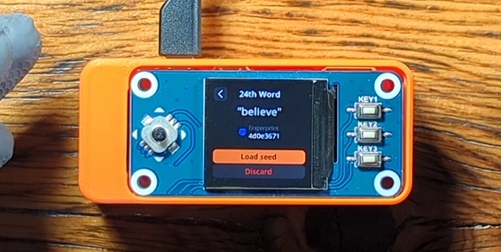
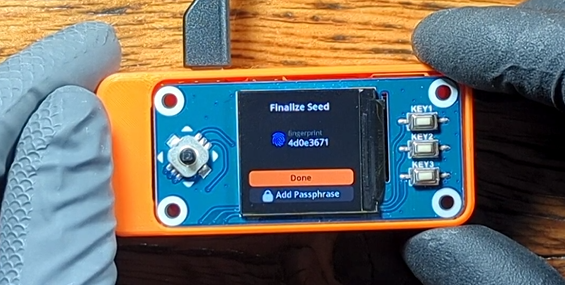

# Generate a New Seed
This section will demonstrate two methods to generate a new master seed with the SeedSigner, with the camera or with dice. As well as how to calculate the checksum of a mnemonic phrase and also how to import a pre-existing mnemonic phrase. The master seed is just a number, a really long and random number. In fact, this number is so long and random that it can be considered truly unique. Practically speaking, the only place in the universe this number exists is on your SeedSigner when you create it. For all intents and purposes, for someone to guess this number would be like guessing the exact same atom from the entire observable universe that you secretly picked. 

This really long random number is used in some clever cryptographic functions to deterministically derive your Bitcoin wallet private/public key pairs, in other words this is how you can generate many receiving addresses and spend from them. There are several ways to represent these long random numbers; binary ones and zeros, hexadecimal 0-9/A-F, a QR code, or even a list of words. Humans have a difficult time handling a numeric representation that is as abstract as 256 ones and zeros, this is why the word lists (or mnemonic phrases) are a popular solution. The long random number is turned into a list of words that are easier for the user to write down and interpret later with accuracy.

If you want to learn more about the processes used with Hierarchical Deterministic wallets and mnemonic phrases, check out [BIP32](https://github.com/bitcoin/bips/blob/master/bip-0032.mediawiki) and [BIP39](https://github.com/bitcoin/bips/blob/master/bip-0039.mediawiki).

Your SeedSigner can communicate this number to you in the form of a list of English words or a QR code; both methods contain the same information, your master seed. Keep in mind that anyone who gains access to this master seed information can use it to re-create your Bitcoin wallet and take the bitcoin from it, so be sure to handle this information securely and privately. 

You will have a couple choices when creating a new seed, capture an image or roll some dice. Both processes involve randomness, which is a key element in creating a secure master seed that cannot be guessed. Best practice is to use a 256-bit number for your master seed which translates to a 24-word mnemonic, the 12-word mnemonics are made from 128-bits. 

# Method 1: With Camera
No two images will be exactly the same and they will all produce drastically different master seeds. The randomness of the image-method involves taking information from several frames prior to the image itself along with some information in the image as well as the unique serial number of the Raspberry Pi Zero processor and the number of miliseconds the device has been powered on for.

## Step 1: Initiate Camera
From the SeedSigner main menu, navigate to `Seeds` > `+ Create a seed` > `"camera icon" New seed`. This will activate the camera, during this time prior to you taking the image, the SeedSigner is capturing frames and using information from these frames to include in the generation of your master seed. 

  
## Step 2: Capture Image
Take an image of something unique. The SeedSigner will display the captured image and then you will have a choice to `reshoot` or `accept`, move the joystick in the appropriate direction for your decision. 

## Step 3: Mnemonic Length
Next, you will be asked which mnemonic length you want to use, 12-words or 24-words. Accept the warning telling you that this information needs to remain private and secure. 

Finally, your mnemonic phrase will be displayed. The screen displays four words at a time. 

Follow the directions in the next section, "Seed Backup", to see how to secure this information. 

# Method 2: With Dice
The randomness of the dice rolls is pretty self explanatory, best practice is to use a balanced dice. The technical definition of entropy with a six-sided dice is calculated by `log2(6) = 2.58 bits of entropy`, this is why it takes 50 rolls for 128 bits or 99 rolls for 256 bits: `log2(6)*99 = 255.9`. By rolling a dice 99 times, you are providing the randomness necessary to create a random number that is impossible to guess. The dice method will give you a choice between 128 bits/50 rolls/12-words or 256 bits/99 rolls24-words.    

Step 1: Initiate Dice Entry
From the SeedSigner main menu, navigate to `Seeds` > `+ Create a seed` > `"dice icon" New seed`. Then select which mnemonic length you want to use, 12-words or 24-words. Accept the warning telling you that this information needs to remain private and secure.  

Step 2: Roll The Dice
Next, you can roll your dice and then enter the result by selecting that number on the SeedSigner screen and pushing the joystick. Repeat this process for all of your rolls.   

  
Step 3: Finalize
When you enter the last roll, the SeedSigner will display the warning about sharing this information. Accept the warning telling you that this information needs to remain private and secure. Finally, your mnemonic phrase will be displayed. The screen displays four words at a time. 

Follow the directions in the next section, "Seed Backup", to see how to secure this information. 

# Calculating a Mnemonic Checksum
The SeedSigner can also import a pre-existing mnemonic phrase of either 12-word or 24-word length.

You can also calculate the last word of a mnemonic phrase with the SeedSigner. A 256-bit number is not quite long enough to generate 24-words. Each word represents 11-bits of the original 128-bit or 256-bit master seed. Each 11-bit segment translates to a numeric value on an index from 0 to 2,047. Each of the 2,048 words on the BIP39 list corresponds to a different numeric value on this index. For example, `256 ÷ 11 = 23.27` but the mnemonic is 24-words or `128 ÷ 11 = 11.63` but the mnemonic is 12-words. The original master seed is hashed with the SHA256 algorithm, that hash value is hashed again. For a 128-bit master seed, the last 4-bits from that secondary hash value is appended to the end of the first hash value; for a 256-bit master seed, the last 8-bits from that secondary hash value is appended to the end of the first hash value. This provides a checksum, so really your 12th or 24th word is actually a checksum that the rest of the proceeding mnemonic is correct. When you add 4-bits to 128-bits you get 132-bits which equals 12 11-bit words. When you add 8-bits to 256-bits you get 264-bits which equals 24 11-bit words. 

SeedSigner can calculate this checksum for you and tell you what the 12th or 24th word is based on the rest of the proceeding mnemonic. This may be helpful if you have a mnemonic phrase that is missing the last word, or if you want to double check a mnemonic, or if you want to pick your own words from the BIP39 list. Although, picking your own words from the BIP39 list will probably not be as random as using the Random Number Generator found in tools like the SeedSigner. 

From the main menu navigate to `Seeds` > `+ Create a seed` > `Calc 12th/24th word` > select mnemonic length `12 words` or `24 words`. 

On the next screen you can start entering the first 11-words for a 12-word mnemonic or the first 23-words for a 24-word mnemonic. Start by entering the first letter of the desired word, the available letters to choose from for the next letter will be reduced the only options based on the BIP39 word list. You can also scroll up or down through a list on the right-hand side of the screen using the `KEY1` and `KEY3` buttons on the HAT display. When you find the word you want, push `KEY2` on the HAT display to select that word and move on to the next one. Continue this process until all 11 or 23 words have been entered. 

After the 11th or 23rd word has been entered, the SeedSigner will display the final word. You will have the option to load that seed into the SeedSigner’s active memory and apply an optional passphrase as well.  

  

# Importing a Mnemonic Phrase
You can also import a pre-existing 12-word or 24-word mnemonic in its entirety. From the main menu, navigate to `Seeds` > then select `Enter 24-word seed` or `Enter 12-word seed`. Then follow the same process above, selecting the first letter of each word until you find the desired word and pressing `KEY2` on the HAT display to select that word. If you enter a word incorrectly, the calculated checksum will be incorrect and the SeedSigner will alert you. 

Once all the words have been entered you will be presented with the wallet fingerprint and given the option to apply an optional passphrase. 

  

