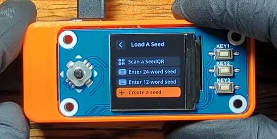
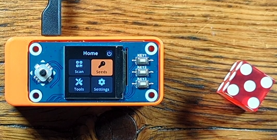
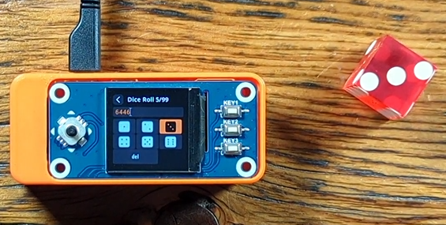

# Generate a New Seed
This section will demonstrate how you can generate a new master seed with the SeedSigner. The master seed is just a number, a really long and random number. In fact, this number is so long and random that it can be considered truley unique. Practically speaking, the only place in the universe this number exists is on your SeedSigner when you create it. For all intents and purposes, for someone to guess this number would be like guessing the exact same atom from the entire observable universe that you secretely picked. 

This really long random number is used in some clever cryptographic functions to deterministically derive your Bitcoin wallet private/public key pairs, in other words this is how you can generate many receiving addresses and spend from them. There are several ways to represent these long random numbers; binary ones and zeros, hexadecimal 0-9/A-F, a QR code, or even a list of words. Humans have a difficult time handling a numeric representation that is as abstract as 256 ones and zeros, this is why the word lists (or mnemonic phrases) are a popular solution. The long random number is turned into a list of words that are easier for the user to write down and interpret later with accuracy.

If you want to learn more about the processes used with Hierarchical Deterministic wallets and mnemonic phrases, check out [BIP32](https://github.com/bitcoin/bips/blob/master/bip-0032.mediawiki) and [BIP39](https://github.com/bitcoin/bips/blob/master/bip-0039.mediawiki).

Your SeedSigner can communicate this number to you in the form of a list of English words or a QR code; both methods contain the same information, your master seed. Keep in mind that anyone who gains access to this master seed information can use it to re-create your Bitcoin wallet and take the bitcoin from it, so be sure to handle this information securely and privately. 

You will have a couple choices when creating a new seed, capture an image or roll some dice. Both processes involve randomness, which is a key element in creating a secure master seed that cannot be guessed. The randomness of the image-method involves taking information from several frames prior to the image itself along with some information in the image. The randomness of the dice rolls is pretty self explainatory, best practice is to use a balanced dice. Another best practice is to use a 256 bit number for your master seed which translates to a 24-word mnmonic, the 12-word mnemonics are made from 128 bits. 

## With Camera
As mentioned, the randomness with the image method is a combination of information taken from several frames prior to the actual image itself plus some information from the image. No two images will be exactly the same and they will all produce drastically different master seeds. 

From the SeedSigner main menu, navigate to `Seeds` > `+ Create a seed` > `"camera icon" New seed`. This will activate the camera, during this time prior to you taking the image, the SeedSigner is capturing frames and using information from these frames to include in the generation of your master seed. 

  
Take an image of something unique. The SeedSigner will display the captured image and then you will have a choice to `reshoot` or `accept`, move the joystick in the appropriate direction for your decision. 

Next, you will be asked which mnemonic length you want to use, 12-words or 24-words. Accept the warning telling you that this information needs to remain private and secure. 

Finally, your mnemonic phrase will be displayed. The screen displays four words at a time. Follow the directions in the next section, "Seed Backup", to see how to secure this information. 

  

## With Dice
Randomness with dice rolls is calculated by `log2(6) = 2.58 bits of entropy`, this is why it takes 50 rolls for 128 bits or 99 rolls for 256 bits: `log2(6)*99 = 255.9`. By rolling a dice 99 times, you are providing the randomness necessary to create a random number that is impossible to guess. The dice method will give you a choice between 128 bits/50 rolls/12-words or 256 bits/99 rolls24-words.    

From the SeedSigner main menu, navigate to `Seeds` > `+ Create a seed` > `"dice icon" New seed`. Then select which mnemonic length you want to use, 12-words or 24-words. Accept the warning telling you that this information needs to remain private and secure.  

Next, you can roll your dice and then enter the result by selecting that number on the SeedSigner screen and pushing the joystick. Repeat this process for all of your rolls.   

  
When you enter the last roll, the SeedSigner will display the warning about sharing this information. Accept the warning telling you that this information needs to remain private and secure. Finally, your mnemonic phrase will be displayed. The screen displays four words at a time. Follow the directions in the next section, "Seed Backup", to see how to secure this information. 

