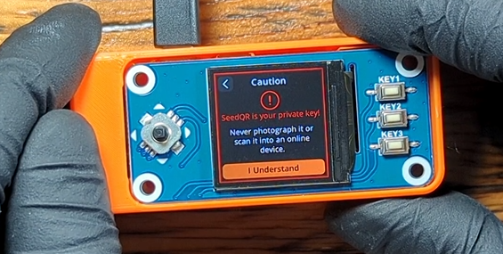
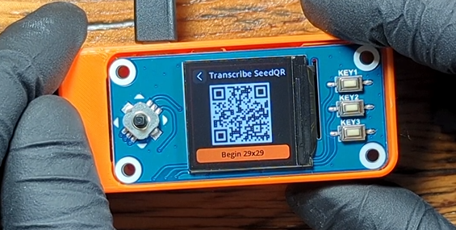
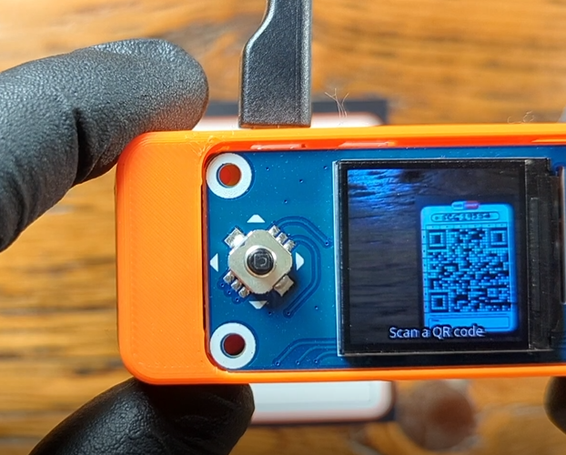
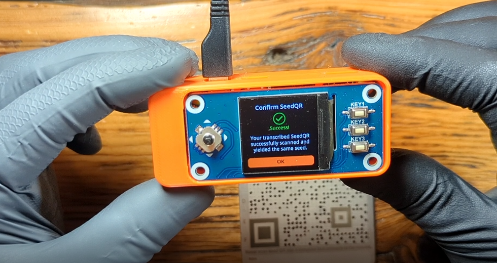

# Seed Backup
This section will demonstrate how to backup the master seed generated on the SeedSigner. There are two ways to backup this information: as a mnemonic phrase or as a QR code. A combination of these two methods can be used for redundant backups. Anyone who gains access to this information will be able to steal your bitcoin, ensure that you take precautions when handling this information. Some basic best practices are to never store this information in a text file, don't save it to a computer, don't take a picture of it, and don't speak the words out loud. Handle this information as if as though it were gold, cash, or jewelery. 

Both the mnemonic phrase and the QR code can be transcribed visually from the SeedSigner display without having to connect the SeedSigner to any device to transfer the information. This keeps the SeedSigner completely air gapped while exporting the master seed. The information transcribed can be to an included paper card or to a stainless steel QR code plate, available from [Vulcan21](https://vulcan21.com/steelqr/). 

Paper cards can be quick and easy to fill out, hidden in many different places, and easily distributed to different geographic locations. Steel plates can take more time to setup, they may not be as easily concealable, but the steel plates will withstand extreme environmental conditions like fire and flooding; they are much more robust than paper.

After you generate a new seed on your SeedSigner, either by taking an image or by dice rolls, the SeedSigner will direct you to the menomic phrase. The mnemonic phrase will be a list of either 12 or 24 English words. If you need to display the mnemonic phrase again after your seed has already been created you can scan in your QR code and navigate to `backup Seed` > `View Seed Words` > accept the warning and then the list of 12 or 24 words will be displayed. If you did not write down your mnemonic phrase or transcribe your QR code when initially creating your master seed and you have cycled the power on your SeedSigner, then you will need to create a new seed as there is no way for the SeedSigner to store that information in memory.  

## Note Card
When you create a new seed, SeedSigner will direct you to the list of 12 or 24 words. You want to write these words down as they are displayed. The back of the included QR code note cards have space for 24 words. Write these words down legibly and in order. Four words are displayed at a time, select `Next` until you have cycled through all the words. 

  

  

Select `Done` when finished and the SeedSigner will prompt you to test yourself on your backup, it is best practice to take this test to ensure your backup was written down correctly.  

On the reverse side of the notecard is a blank 29x29 QR code grid. You can visually transcribe your master seed in QR code format onto the notecard. This makes importing your wallet into SeedSigner as fast as scanning a QR code can be. 

After taking the test to confirm the mnemonic phrase, you can scroll down the menu on you SeedSigner to `Backup Seed` > `Export as SeedQR` > `I Understand` > `Begin 29x29`.

  
  
  
  

  
  
The SeedSigner will then display a magnyfied view of the QR code, one segemnt at a time starting on A1. You can toggle the joystick to navigate through the rest of the segments and visually transcribe the darkened squares you see on the screen to the card using a permanant marker. There are four pre-defined squares on the QR code, that are already printed on the card for you.

  
  

 

There is error correction built into the QR code scanning software, meaning that if you misplace a few squares the SeedSigner will still be able to produce your seed. Try to be as accurate as possible though. 

Once you have the QR code transcribed, test it by scanning it and checking the fingerprint, an 8-character string that uniquely identifies your wallet.

  

If you are using a passphrase on your wallet, you will need to decide how you want to handle this added piece of information. A passphrase can be thought of as a 13th or 25th word added to your mnemonic phrase. A passphrase can be a string of any combination of upper case letters, lower case letters, numbers, and special characters. Only you will know this passphrase and there is no way for the SeedSigner or anyone to help you recover a lost or forgotten passphrase. By entering a passphrase on your wallet, this added piece of information will be required each time you want to access this wallet in the future. 

There is a tool maintained by [@BitcoinQ_A](https://twitter.com/BitcoinQ_A) that can assist you in trying different passphrases over a mnemonic phrase in case you write down the passphrase incorrectly but have a rough idea of what it should be. You can enter your mnemonic words and a receiving address and test different passphrases. Use this tool offline by downloading it, do not enter your mnemonic phrase or passphrase into a network connected device. 

Visit [Bitcoiner.Guide/seed/](https://bitcoiner.guide/seed/) to learn more.

Decide if you want to write down the fingerprint for the mnemonic phrase wallet, or the fingerpring for the passphrase applied wallet, or both. In this example, the generated fingerprint once the QR code is scanned is different from the fingerprint generated once the passphrase is applied. 

  
Or in this axample, the primary wallet fingerprint it noted at the top and then the finger print for the passphrase applied wallet is noted at the bottom with the indicator "PP" for passphrase. Keep in mind too, that if you store your mnemonic phrase with your seed phrase then an adversary would have all the information the need to steal your bitcoin. However, you store your passphrase separate from your mnemonic phrase then there is added security. 

One thing to consider as well is that although the fingerprint itself will not put the security of your bitcoin at risk directly, the simple existance of an additional fingerprint could be enough to tip off an adversary that there is another bitcoin wallet which a passphrase is needed to access. If you setup a duress wallet with a small amount of bitcoin in the primary wallet and the majority of bitcoin in the passphrase applied wallet, this could be a consideration for you. 

## QR Code Steel Plate
The initial process for creating a steel QR code backup is much the same as for the notecard version. After you have secured your mnemonic phrase, on the SeedSigner navigate to `Backup Seed` > `Export as SeedQR` > `I Understand` > `Begin 29x29`. Alternatively, you could transcribe this information from a pre-existing notecard QR code if you already have one backup that you are upgrading to steel. 

Use a permanent marker to mark where the punches should be made. 

If you make a mistake, you can remove the permanent marker with acetone and a Q-tip. There is error correction software in the SeedSigner that tolerates some misplaced dots, but it is best practice to be as accurate as possible. 

Prior to stamping the dots with a punch, test the QR code with the SeedSigner. 

Now you are ready to stamp the dots permanently into the steel plate with a punch. This demonstration uses what is known as a "Prick Punch" and a 4-pound mini sledge hammer on a concrete floor. Having a solid surface to hammer on and a heavy hammer is key to getting crisp clear punches. 

  
  

 

  

A letter & number stamp set can be used to mark additional information onto the steel plate such as the fingerprint. Agian, make careful considerations how you will store information related to passphrase applied wallets. In this example, the primary fingerprint is marked on top, this is the resulting fingerprint when the QR code is scanned. On the bottom, the "PP" indication is used to symbolize `passphrase` followed by the resulting fingerprint when the passphrase is applied.  

  

Be sure to test your stamped QR code steel plate by scanning it with your SeedSigner. Be aware that you may need to try different lighting conditions.

 

You should have well defined and clear marks in your steel plate that match the notecard QR code.

 

Your Steel QR code is now ready to be securely stored. 

## Fire Test
To verify that the wallet information could be recovered in the event of catastrophic events such as fire, the steel plate was heated up to just below melting temperatures using an oxygen & acetelyne torch. Ideally, in the event of a fire, the QR code on the steel plate would still be able to be scanned and recovered quickly. However, fire can cause the finish on the plate to disapear leaving very little distinction between the plate background and the darkened areas. Recovery in this case can still be possible by visually transcribing the information from the burnt QR code steel plate to a paper notecard and then scanning the QR code on the notecard. This stress test revealed that the steel plate can withstand temperatures just below 1,500° C, well below typical house fire temperatures, and the information contained within the steel plate was still 100% recoverable by visually transcribing the QR code to a paper notecard.
