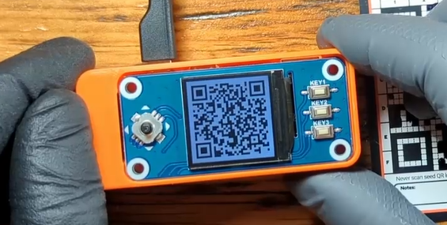
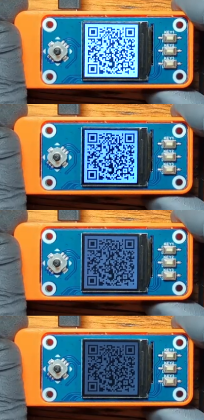
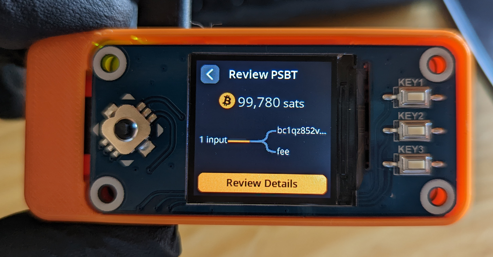

# Sparrow Wallet
This section will demonstrate how to import your wallet to Sparrow Wallet from SeedSigner. The concept here is that the SeedSigner will use your private key to sign transactions and Sparrow Wallet will generate those transactions for the SeedSigner to sign. This way, you can keep your private key off of a network connected device while still being able to check your wallet balance and generate receiving addresses safely. 

Importing a wallet in this manner enables you to have a "watch-only" wallet available on your Personal Computer (PC) without putting your bitcoin private keys at risk. The watch-only wallet can display your balance and generate receiving addresses without you needing to go through the process of opening your wallet with your SeedSigner each time. You would just use your SeedSigner when you want to sign transactions from this wallet to spend those bitcoin.

For more information on installing Sparrow Wallet and connecting it to a node, check out the [Sparrow Wallet website](https://www.sparrowwallet.com/).

This demonstration uses Sparrow Wallet installed on a Windows desktop using [Bitcoin Core](https://bitcoincore.org/) as the node backend. 

## Step 1: Initiate Import
Once you have Sparrow Wallet installed and open on your PC, navigate to `File` > `Import Wallet`

## Step 2: Device Selection
In the pop-up window, scroll down and select `SeedSigner` then `Scan` to launch your webcam. 

## Step 3: Export Watch-Only Information
- On your SeedSigner, scan your seed QR code and enter your passphrase. 
- Then go to `Export Xpub` and select your wallet. 
- Then choose your quorum type, `Single Sig` or `Multisig` (single sig is used in this demo). 
- Then choose your script type (the kind of addresses you want to use) `Native Segwit` or `Nested Segwit`.  
- Then select your Bitcoin wallet application (Sparrow Wallet in this example).  

  
  
  
  

You will receive a warning about privacy implications of exporting your Xpub, then you will have a chance to review the details. Once you select `Export Xpub` the series of animated QR codes will begin and you can hold your SeedSigner up to your PC webcam so that Sparrow Wallet can gather the details it needs to import your watch-only wallet. 

  
  
  
  

If you are having trouble with the brightness of the HAT display, you can hold the joystick in the up or down position during the animated QR code loop to change the brightness of the screen. There are 8 brightness levels from very dim to very bright. 

## Step 4: Finalize Import
Back in Sparrow Wallet, once you scan the animated QR codes, you can name your new wallet and add an optional password. Be careful not to confuse this password with your passphrase. This password in Sparrow Wallet is just to encrypt the wallet file on your PC. 

  
  

## Step 5: Receiving bitcoin
Once your node finishing scanning for any transactions (automatic process), you will be at your wallet home screen in Sparrow Wallet. If you click on the `Receive` tab on the left-hand side of the interface, you will see the first address on your SeedSigner that you can deposit some bitcoin to.  

  
  

Once you make a deposit, the transaction should show up right away in Sparrow Wallet as `Unconfirmed` until it receives some block confirmations. Once this deposit is made, a signature from your SeedSigner will be required to spend it. 

# Creating A PSBT
Once you have bitcoin deposited to your wallet, you can create a Partially Signed Bitcoin Transaction (PSBT) in Sparrow Wallet. Then you can exchange QR codes back and forth between the SeedSigner and Sparrow Wallet to sign the transaction air-gapped with your SeedSigner. 

## Step 1: UTXO Selection
From Sparrow Wallet, navigate to your `UTXOs` tab on the left-hand side of the interface. Then select the UTXO you want to spend. Alternatively, you could just select the `Send` tab instead and enter an amount, but in this example the entire UTXO is being spent. 

## Step 2: Build Transaction
- On the next screen, you can enter the address you want to spend the bitcoin to. 
- Add a label so you remember what the transaction was for. 
- Enter the amount (or select max amount in this case) 
- Set your miner fee rate. 
- Then click on `Create Transaction once you have all the details filled in`. 

## Step 3: Finalize Transaction 
On the next screen you will be presented with the transaction ID (txid) and a graph showing the inputs and outputs to the transaction. Click on `Finalize Transaction for Signing`. 

## Step 4: Animated QR Codes 
On the next screen, click on `Show QR` and Sparrow Wallet will display a series of animated QR codes in a pop-up window. Then you can scan those with your SeedSigner. If you have not done so already, you will need to power on your SeedSigner, scan your QR code seed phrase, enter your passphrase, and then select the option to sign the PSBT. 

## Step 5: Confirmation
On your SeedSigner you will confirm several details about this transaction.
- Make sure you select the correct wallet, noting the fingerprint.
- Check the amount and input/output graph.
- You will be warned if this is a full spend. 
- Verify that the transaction math check out. 

  
  
  
  

  
## Step 6: Signing  
- Double check the address you are sending to. 
- Approve the PSBT if everything looks good. 
- Select the Bitcoin wallet application you are working with (Sparrow Wallet in this case).
- In Sparrow Wallet, select `Scan QR` then hold up the animated series of QR codes flashing on the SeedSigner screen.

  
  
  
  

## Step 7: Broadcast
Once the details are received by Sparrow Wallet, then select `Broadcast Transaction`. 

Once your transaction is broadcast to the Bitcoin network, then you can use your favorite block explorer to keep an eye on it.

# Importing Private Key
As of Sparrow Wallet version 1.6.4, you can scan your private key QR code and import to Sparrow Wallet. If you are trying to keep your wallet air-gapped then do not attempt this as it will put your private key on a device that is either currently connected to the internet or has been/will be connected to the internet. The risk here is that you could be creating a hot wallet. By following the steps below, Sparrow Wallet will write a wallet file to your PC. This wallet file will contain your private key. If your computer is compromised in the future and this file is found then your bitcoin could be at risk. Using a password to encrypt this wallet file is a minimum recommended precaution if you choose to proceed. A passphrase will not be stored in the wallet file and this is another safeguard you can use to help protect your bitcoin in the event that your private key is exposed. Importing a private key can be useful for quickly generating your wallet, constructing a transaction, and broadcasting it without having to pass details back and forth to the SeedSigner if you find yourself in a situation where time is of the essence and your signing device is unavailable to you. If you want the convenience of being able to generate receiving addresses and checking your balance without the security vulnerability of having your private keys on a network connected device, then use the watch-only wallet option described above. You can also sign a PSBT in Sparrow Wallet using your SeedSigner QR code and Sparrow Wallet will not save that information, if you are in an emergency.

## Step 1: Initiate Import
In Sparrow Wallet, navigate to `File` > `Import Wallet`

## Step 2: Select Method
A window will pop up with several import options. On the `Mnemonic Words` option, click on the drop-down menu and choose `Scan QR`.

## Step 3: Scan QR Code
Your webcam should automatically launch, hold up your SeedSigner private key QR code so Sparrow Wallet can gather the details. 

## Step 4: Passphrase
If you have a passphrase applied to your wallet, enter it now. Then click on `Discover Wallet`.

## Step 5: Name Wallet
Then you will be asked to name your new wallet. Once you have entered a name, click on `Create Wallet`.

## Step 6: Add Password
Optionally, you can add a password to protect this wallet file. This password should not be cobnfused with your _passphrase_. This password will encrypt the wallet file saved on your PC. 

## Step 7: Confirm Passphrase
You will then be asked to confirm the passphrase you entered. 

Now you have a fully functional wallet from your SeedSigner now live in Sparrow Wallet. Remember, if you are using Sparrow Wallet on a network connected PC then this is no longer an air-gapped wallet. However, you can now quickly construct and broadcast transactions. 

Another benefit is that now you can find your PayNym to start making collaborative transactions and you can use the Sparrow Wallet Whirlpool implementation for the privacy benfits.

Navigate to `Tools` > `Show PayNym`. 

Then click on `Retrieve PayNym`:

To learn more about making collaborative transactions or using Whirlpool, check out the [Documents section of Sparrow Wallet website](https://www.sparrowwallet.com/docs/mixing-whirlpool.html) or the [Privacy section of the Bitcoiner.Guide website](https://bitcoiner.guide/articles/).
