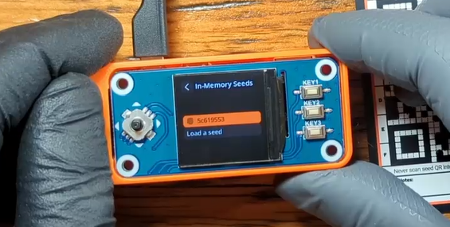
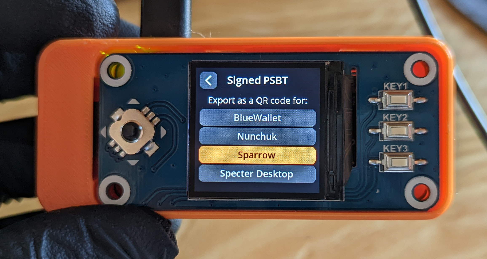

# Sparrow Wallet
This section will demonstrate how to import your wallet to Sparrow Wallet from SeedSigner. 

Importing a wallet in this manner enables you to have a "watch-only" wallet available on a network connected device without putting your bitcoin directly at risk. The watch-only wallet can display your balance and generate receiving addresses without you needing to go through the process of opening your wallet with your SeedSigner each time.

For more information on installing Sparrow Wallet and connecting it to a node, check out the [Sparrow Wallet website](https://www.sparrowwallet.com/).

This demonstration uses Sparrow Wallet installed on a Windows desktop using [Bitcoin Core](https://bitcoincore.org/) as the node backend. 

Step 1: Once you have Sparrow Wallet installed and open on your PC, navigate to `File` > `Import Wallet`

Step 2: In the pop-up window, scroll down and select `SeedSigner` then `Scan` to launch your webcam. 

Step 3: 
- On your SeedSigner, scan your seed QR code and enter your passphrase. 
- Then go to `Export Xpub` and select your wallet. 
- Then choose your quorum type, `Single Sig` or `Multisig` (single sig is used in this demo). 
- Then choose your script type (the kind of addresses you want to use) `Native Segwit` or `Nested Segwit`.  
- Then select your Bitcoin wallet application (Sparrow Wallet in this example).  

  
  
  
  

You will receive a warning about privacy implications of exporting your Xpub, then you will have a chance to review the details. Once you select `Export Xpub` the series of animated QR codes will begin and you can hold your SeedSigner up to your PC webcam so that Sparrow Wallet can gather the details it needs to import your watch-only wallet. 

  
  
  
  

Step 4: Back in Sparrow Wallet, once you scan the animated QR codes, you can name your new wallet and add an optional password. Be careful not to confuse this password with your passphrase. This password in Sparrow Wallet is just to encrypt the wallet file on your PC. 

  
  

Step 5: Once your node finishing scanning for any transactions (automatic process), you will be at your wallet home screen in Sparrow Wallet. If you click on the `Receive` tab on the left-hand side of the interface, you will see the first address on your SeedSigner that you can deposit some bitcoin to.  

  
  

Once you make a deposit, the transaction should show up right away in Sparrow Wallet as `Unconfirmed` until it receives some block confirmations. Once this deposit is made, a signature from your SeedSigner will be required to spend it. 

## Creating A PSBT
Once you have bitcoin deposited to your wallet, you can create a Partially Signed Bitcoin Transaction (PSBT) in Sparrow Wallet. Then you can exchange QR codes back and forth between the SeedSigner and Sparrow Wallet to sign the transaction air-gapped with your SeedSigner. 

Step 1: 
From Sparrow Wallet, navigate to your `UTXOs` tab on the left-hand side of the interface. Then select the UTXO you want to spend. Alternatively, you could just select the `Send` tab instead and enter an amount, but in this example the entire UTXO is being spent. 

Step 2: 
- On the next screen, you can enter the address you want to spend the bitcoin to. 
- Add a label so you remember what the transaction was for. 
- Enter the amount (or select max amount in this case) 
- Set your miner fee rate. 
- Then click on `Create Transaction once you have all the details filled in`. 

Step 3: On the next screen you will be presented with the transaction ID (txid) and a graph showing the inputs and outputs to the transaction. Click on `Finalize Transaction for Signing`. 

Step 4: On the next screen, click on `Show QR` and Sparrow Wallet will display a series of animated QR codes in a pop-up window. Then you can scan those with your SeedSigner. If you have not done so already, you will need to power on your SeedSigner, scan your QR code seed phrase, enter your passphrase, and then select the option to sign the PSBT. 

  
  

Step 5: On your SeedSigner you will confirm several details about this transaction.
- Make sure you select the correct wallet, noting the fingerprint.
- Check the amount and input/output graph.
- You will be warned if this is a full spend. 
- Verify that the transaction math check out. 

  
  
  
  

  
- Double check the address you are sending to. 
- Approve the PSBT if everything looks good. 
- Select the Bitcoin wallet application you are working with (Sparrow Wallet in this case).
- In Sparrow Wallet, select `Scan QR` then hold up the animated series of QR codes flashing on the SeedSigner screen.

  
  
  
  

Once the details are received by Sparrow Wallet, then select `Broadcast Transaction`. 

Once your transaction is broadcast to the Bitcoin network, then you can use your favorite block explorer to keep an eye on it.

