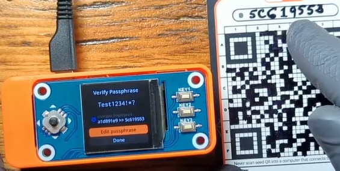
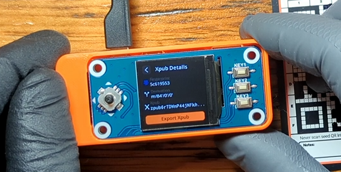
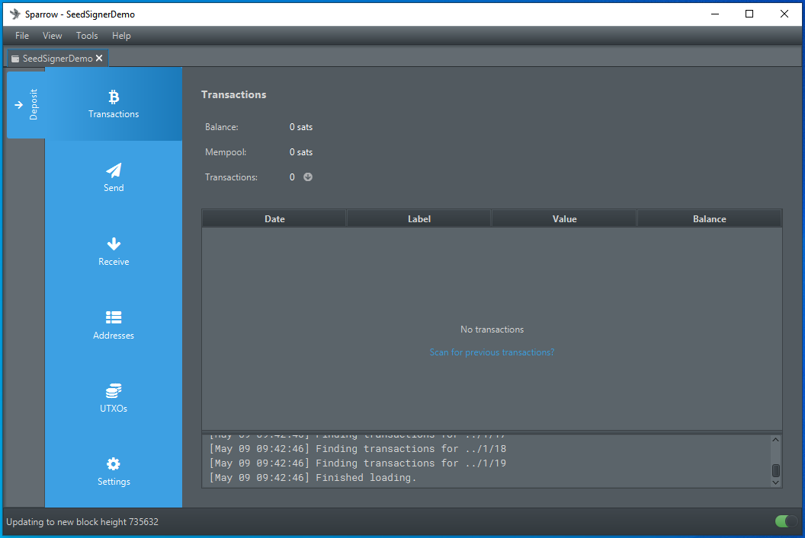

# Sparrow Wallet
This section will demonstrate how to import your wallet to Sparrow Wallet from SeedSigner. 

Importing a wallet in this manner enables you to have a "watch-only" wallet available on a network connected device without putting your bitcoin directly at risk. The watch-only wallet can display your balance and generate receiving addresses without you needing to go through the process of opening your wallet with your SeedSigner each time.

For more information on installing Sparrow Wallet and connecting it to a node, check out the [Sparrow Wallet website](https://www.sparrowwallet.com/).

This demonstration uses Sparrow Wallet installed on a Windows desktop using [Bitcoin Core](https://bitcoincore.org/) as the node backend. 

Step 1: Once you have Sparrow Wallet installed and open on your PC, navigate to `File` > `Import Wallet`

Step 2: In the pop-up window, scroll down and select `SeedSigner` then `Scan` to launch your webcam. 

Step 3: 
- On your SeedSigner, scan your seed QR code and enter your passphrase. 
- Then go to `Export Xpub` and select your wallet. 
- Then choose your quorum type, `Single Sig` or `Multisig` (single sig is used in this demo). 
- Then choose your script type (the kind of addresses you want to use) `Native Segwit` or `Nested Segwit`.  
- Then select your Bitcoin wallet application (Sparrow Wallet in this example).  

  
  
  
  

You will receive a warning about privacy implications of exporting your Xpub, then you will have a chance to review the details. Once you select `Export Xpub` the series of animated QR codes will begin and you can hold your SeedSigner up to your PC webcam so that Sparrow Wallet can gather the details it needs to import your watch-only wallet. 

  
  
  
  

Step 4: Back in Sparrow Wallet, once you scan the animated QR codes, you can name your new wallet and add an optional password. Be careful not to confuse this password with your passphrase. This password in Sparrow Wallet is just to encrypt the wallet file on your PC. 

  
  

Step 5: Once your node finishing scanning for any transactions (automatic process), you will be at your wallet home screen in Sparrow Wallet. If you click on the `Receive` tab on the left-hand side of the interface, you will see the first address on your SeedSigner that you can deposit some bitcoin to.  

  
  

Once you make a deposit, the transaction should show up right away in Sparrow Wallet as `Unconfirmed` until it receives some block confirmations. Once this deposit is made, a signature from your SeedSigner will be required to spend it. 

## Creating A PSBT
