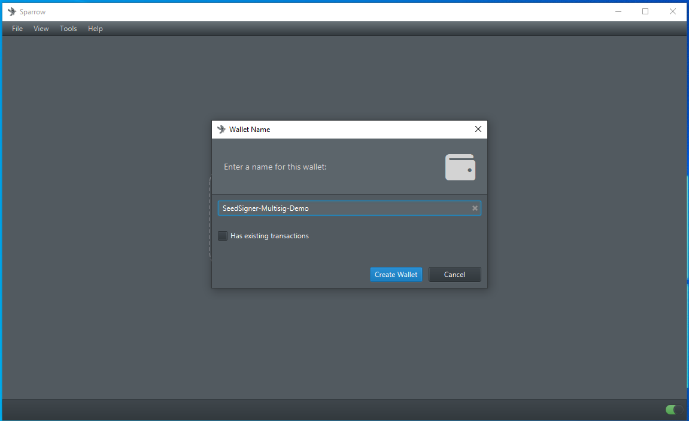
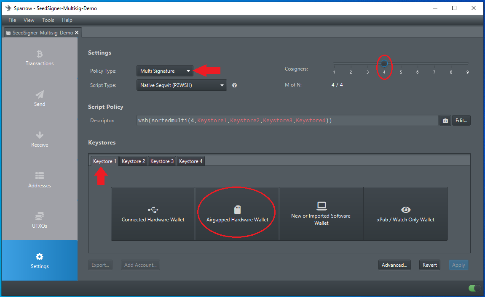

# Multisig
This section demonstrates how to setup a multisig wallet using SeedSigner and Sparrow Wallet. 

## Step 1: Generate Seeds
First, create as many new seeds as you want for your multisig quorum. Follow the same process explained in the "Generate-Seed" section, use either the image capture method or the dice roll method. You can apply an optional passphrase as well. 

In this example, four new seeds were generated to construct a 4-of-4 multisig. A passphrase was applied to each one.  

  
  
  
  

  

## Step 2: Create MultiSig Wallet in Sparrow
- In Sparrow Wallet, navigate to `File` > `New Wallet`.
- Then name your new multisig wallet.

## Step 3: Configure the MultiSig Quorum
- Select `Multi Signature` from the Policy Type drop-down menu. 
- Set the `M of N` cosigners. This is the minimum number of required signatures you want for your wallet. Typical quorums are 3-of-5 or 5-of-7, etc. 4-of-4 was used in ths example.
- You will notice that a new keystore tab appears at the bottom of the screen for each of the cosigners you add.
- Once that is set, you can select `Airgapped Hardware Wallet` to import the first cosigner. The xpub information will be exported from SeedSigner for each wallet in this example to preserve the air-gapped advantage. 

## Step 4: Initiate PC Webcam
Once you click on `Airgapped Hardware Wallet`, a window will pop up with several options, next to the SeedSigner icon, click on `Scan`. This will launch your PC webcam. 

## Step 5: Export Xpub
- On your SeedSigner, you should have all of your seeds loaded that you want to export. If you need to, scan the QR codes to load them now. Select the first one.
- Scroll down to `Export Xpub`.  
- Select `Multisig`.
- Select script type, `Native Segwit` was used in this example. 
- Then select the wallet application, `Sparrow` was used in this example. 
- Accept the warning about the potential privacy leak exporting your xpub poses. 

  
  
  
  
  
  

  

## Step 6: Confirm Details
SeedSigner will display the details of what you are about to export. Look them over and confirm everything is correct. You want to ensure that the displayed fingerprint matches the passphrase-applied fingerprint you have written down. 

## Step 7: Import Xpub
The SeedSigner will start to flash a series of animated QR codes that contain your xpub information. Hold this up to your PC webcam so that Sparrow Wallet can gather the details necessary to import your first cosigner. 

## Step 8: Confirm & Repeat
Once Sparrow Wallet gets the details that it needs, it will populate several fields under the first keystore tab. Double check that this information is correct, taking care to ensure the fingerprint it correct. If everything looks good, then click on the second keystore tab and repeat that process with your second cosigner, then again for your third, and so on. 

## Step 9: Finalize
Once you have all of your cosigners imported, click on `Apply`. 

If you want to add an optional password, you can do so when Sparrow Wallet prompts you. This is not to be confused with your _passphrase_. The password encrypts the wallet file saved on your PC. 

# Spending
Your new multisig wallet is now ready to deposit to. You can generate receive addresses from Sparrow Wallet and deposit bitcoin. You will need your minimum number of cosigners to each sign the transaction to spend bitcoin deposited to this multisig wallet. 

When you want to spend your bitcoin, navigate to the `Send` tab in Sparrow Wallet and fill out the address you wish to spend to, add a label, set the amount to spend, and select a miner fee rate. Then click on `Create Transaction`.

Then click on `Finalize Transaction for Signing`.

Then you will have the option to display the transaction QR code so that you can scan it from the SeedSigner with the appropriate cosigners loaded. You will have to do each one individually. Once the SeedSigner receives the information it needs, it will display the signed PSBT as an animated QR code to be scanned by your PC webcam for Sparrow Wallet to receive. This is the same process used for signing transactions covered in the "Sparrow-Wallet" section, only you have to do it for as many minimum number of cosigners you have set on your multisig wallet. 

# Example
To spread awarness of SeedSigner, Sparrow Wallet, & multisig wallet; 100,000 sats were depsoited to the 4-of-4 multisig wallet in this guide. You can see the transaction here: [mempool.space](https://mempool.space/tx/dec20d2e6e3ce792124ddd738473e60ac7cf5444b3d24e78dff5871a6528c2bc).

The scavenger hunt was announced on Twitter here: [econoalchemist](https://twitter.com/econoalchemist/status/1528497446606606336?s=20&t=l_egT555rddanOrEqpAplQ).
